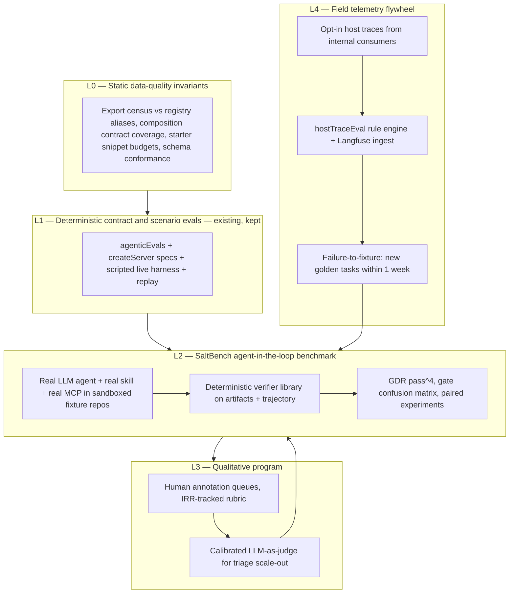
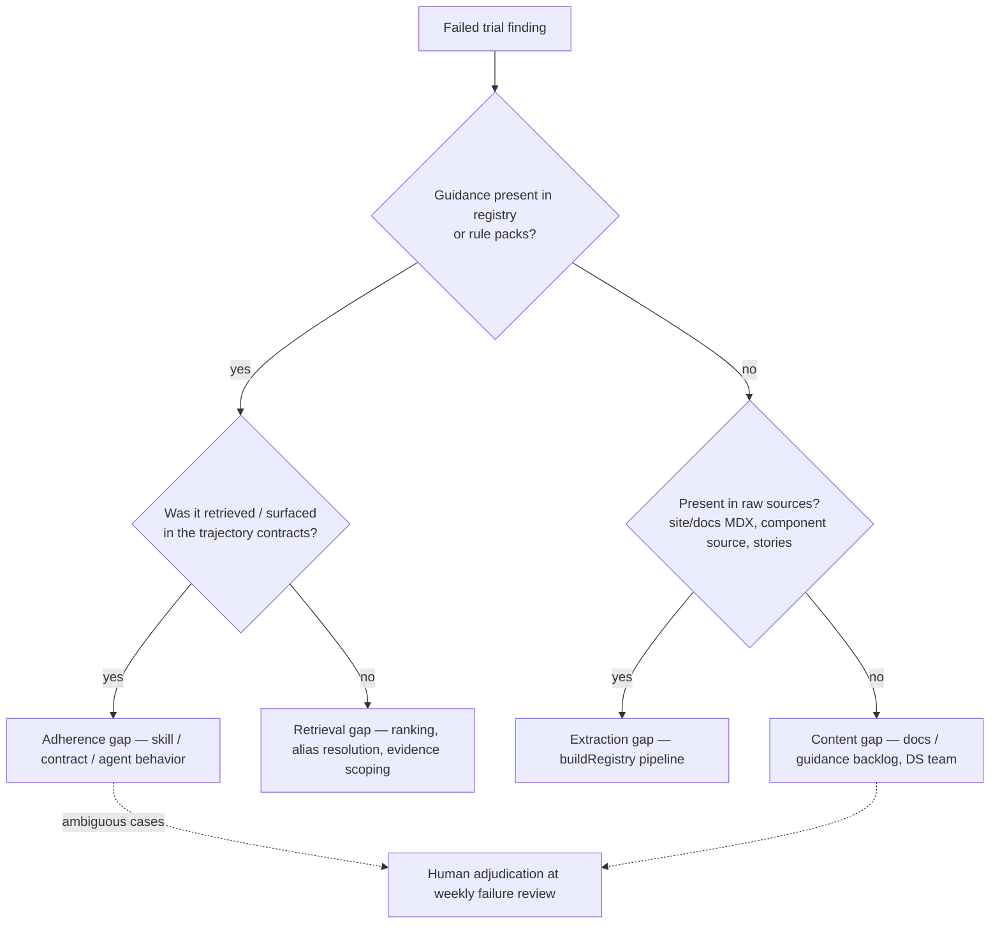
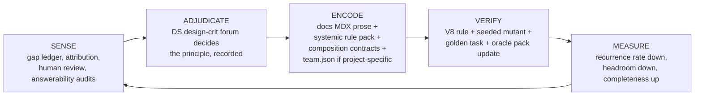
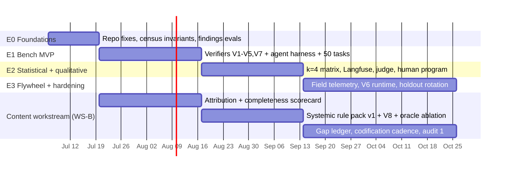

# Salt AI Tooling Evaluation Strategy

**Program name:** SaltBench — Grounded Outcome Evaluation for the Salt AI tooling surface
**Scope:** `@salt-ds/mcp`, `@salt-ds/semantic-core` (registry + workflow logic), the `salt-ds` skill, and the host-agent interaction contract (`salt_workflow_v1`)
**Status:** Proposed — v1.0
**Audience:** AI tooling maintainers, design system engineering leads, project planning

---

## 1. Executive summary

The single evaluation strategy this plan commits to is:

> **Outcome-anchored, agent-in-the-loop evaluation against a versioned golden task dataset, verified by deterministic ground-truth checkers built from the design system itself, wrapped in a statistical protocol (pass^k, paired experiments, bootstrap confidence intervals) that makes every improvement claim falsifiable — with a closed telemetry flywheel that converts real consumer sessions into new eval cases, and a calibrated human + LLM-judge program for the qualitative residue that deterministic checks cannot reach.**

One sentence shorter: **measure whether a real agent, using the real skill and the real MCP server, produces verifiably correct Salt UI — repeatedly — and never ship a change without a paired, statistically-read comparison on the same task set.**

This is not a menu of options. The layers described below (static invariants, deterministic contract evals, agent-in-the-loop benchmark, human/judge review, field telemetry) are components of one pipeline with one headline metric:

> **North-star metric: Grounded Delivery Rate (GDR)** — the fraction of golden tasks for which the end-to-end system (host agent + skill + MCP) produces artifacts that pass **all** deterministic verifiers **and** a trajectory with **zero** critical gate violations. Reported as **pass^4** (probability of 4/4 consecutive successes — the reliability bound) alongside mean pass@1 with 95% bootstrap CIs.

Why this is the right single strategy for this codebase specifically:

1. **The ground truth is in this repo.** Unlike most agent evals, Salt owns the oracle: real package exports, docgen prop tables, composition contracts, deprecation data, and the doc corpus that the registry is built from. Verification can therefore be *deterministic and cheap* (compile, AST checks, export census) rather than LLM-judged and noisy. LLM-as-judge is reserved for genuinely subjective dimensions and is itself calibrated against human labels before it is trusted.
2. **The existing eval stack is strong below the agent boundary and blind above it.** Every current layer (deterministic evals, "live" harness, replay, host-trace rules) is model-free. The `findings.md` session proves the gap: every server-side gate passed while the joint system shipped invented `VerticalNavigation` JSX, skipped the post-create review, and contradicted itself in review. The missing layer is the one where an actual LLM interprets the skill, calls the tools, and writes code — and where we verify what it wrote.
3. **The product's core promise is a hard gate.** A gate has two failure directions — *false allow* (evidence incomplete but implement issued: the invention risk from findings.md) and *false block* (legitimate work stopped: the adoption risk). Only an end-to-end harness plus field telemetry can measure both sides of that confusion matrix.
4. **Single-run scores are noise at the effect sizes we care about.** Published agent-eval work (τ-bench, MCPMark, "On Randomness in Agentic Evals", arXiv 2602.07150) shows single-run pass@1 varies by 2–6 points run-to-run even at temperature 0, and that pass^k is the deployment-relevant reliability bound. Our protocol therefore mandates multiple trials, paired comparisons, and CIs before any "improvement" claim.
5. **The content is a system-under-test too.** The registry only knows what the docs corpus encodes, and Salt correctness is relational ("valid components, wrong system" — e.g. nested Cards — must fail). The program therefore runs two workstreams off one instrument: tooling engineering and **content & guidance engineering** (owned by the design system team), connected by failure attribution, oracle-context ablations that measure documentation gaps causally, and a systemic usage rule pack that encodes above-component correctness (§11).

**External dependency decision:** adopt **Langfuse (self-hosted, MIT-licensed core)** as the trace store, dataset mirror, experiment comparison UI, human annotation queue, and LLM-as-judge runner — ingesting via OpenTelemetry (OTLP). It is appropriate here: all needed capabilities (datasets, experiments, annotation queues, judges, OTel ingest) are in the MIT core with no usage limits, it self-hosts inside enterprise infrastructure so no trace data leaves the network, and it removes ~2 quarters of dashboard/annotation tooling build. **All verification logic, task definitions, and pass/fail decisions stay in this repo**; Langfuse is the system of record for traces, scores, and annotations — never the gatekeeper. CI gates read repo-produced JSON scorecards, so CI remains functional if Langfuse is down.

---

## 2. Current state assessment

### 2.1 What exists today (and is worth keeping)

| Layer | Entry point | What it does | LLM involved | In CI |
|---|---|---|---|---|
| Deterministic workflow evals | `yarn eval:deterministic` → `packages/mcp/src/__tests__/agenticEvals.spec.ts` | ~27 direct semantic-core calls asserting routing, gates, starter code, policy behavior; plus a 20-prompt tool-selection corpus scored by a TF-IDF ranker | No | Yes (via `yarn test`) |
| MCP contract tests | `packages/mcp/src/__tests__/createServer.spec.ts` | Exact 5-tool surface, read-only annotations, schema shape, resources | No | Yes |
| "Live" harness | `yarn eval:live` → `packages/mcp/src/evals/workflowEvalHarness.ts` | Spawns the real MCP server over stdio, runs a **scripted 2-call sequence** (context → workflow tool) for 6 scenarios, judges with a deterministic rubric, enforces payload/latency budgets | No | No |
| Replay harness | `yarn eval:replay` → `workflowEvalReplay.ts` + 15 fixtures in `packages/mcp/eval-fixtures/replays/` | Re-judges saved `{scenario, trace}` JSON with the same rubric | No | No (logic covered by spec in CI) |
| Host trace eval | `yarn eval:traces` → `packages/mcp/src/evals/hostTraceEval.ts` | Rule engine over exported IDE chat traces; 9 critical failure codes (`implement_without_source_backed_evidence`, `ask_user_ignored`, `review_post_action_skipped`, …) | No | No (needs user-provided traces) |
| Host attachment eval | `hostAttachmentEval.ts` | Deterministic rubric for screenshot→source-outline preprocessing, incl. a hostile-instruction case | No | Yes |
| Consumer smoke | `yarn smoke:consumer` | Installs the packed MCP into fixture repos, asserts the v1 tool/resource surface end-to-end | No | Yes |

These are genuinely good assets: the contract is machine-checkable, the fixture repos (`existing-salt`, `existing-salt-policy`, `non-salt`, `new-project`) are reusable sandboxes, the scorecard already tracks pass rate, payload bytes, and latency, and the host-trace rule engine is a ready-made trajectory verifier. **The strategy below reuses all of them rather than replacing them.**

### 2.2 The measured gap (evidence from `findings.md`)

A real Cursor session using the skill + MCP to create and then review a financial dashboard produced this failure chain, **without tripping a single existing eval**:

1. `create_salt_ui` returned `partial` with follow-through required for *Table, Card, App header, Header block* — but **not** for `VerticalNavigation`, which the agent also planned to use. Pattern-level evidence scope ≠ per-component evidence scope (findings root cause #1).
2. `get_salt_reference` returned `not_found` for `VerticalNavigation`, `BorderLayout`, `StackLayout`, `GridLayout`, `H1` — all real, stable `@salt-ds/core` exports. Registry alias/name normalization does not match export names (root cause: catalog data quality).
3. The agent echoed the unresolved names back in `resolved_entities`; the gate flipped to `status: success` / `action.kind: implement`. Mechanically confirmed in `packages/semantic-core/src/tools/publicContract.ts` (`buildResolvedFollowThroughEvidence`): names are registry-verified **only if they appear in `required_follow_through`** — extra names are simply never gated.
4. The agent implemented `VerticalNavigation` from memory, omitting the canonical `VerticalNavigationItemContent` wrapper — a composition bug neither `create_salt_ui` nor `review_salt_ui` can currently detect.
5. The blocking post-create review ran on truncated code, returned `blocked`, and the agent marked create complete anyway (skill step violated, nothing enforced or measured it).

Every one of these is a *joint-system* failure: partly server contract semantics, partly registry data quality, partly skill adherence, partly review capability. **No layer of the current stack executes the joint system**, so no layer could have caught it pre-release, and — critically — after we fix these bugs, no current layer can prove the fix moved the needle.

### 2.3 Additional infrastructure gaps

- `eval:live:test` in the root `package.json` references `packages/mcp/src/__tests__/liveEvalHarness.spec.ts`, which does not exist — the script is broken.
- No telemetry/instrumentation exists in the MCP server (no OTel, no structured event log), so field sessions can only be analyzed via manual IDE chat exports.
- No statistical treatment anywhere: single-run pass/fail, no repeated trials, no CIs, no paired before/after protocol.
- No measurement of the *artifacts* agents produce (code is never compiled, type-checked, AST-checked, rendered, or reviewed post-hoc by the harness).
- No human evaluation program, no failure taxonomy beyond the 9 host-trace codes, no judge of subjective quality (UX fidelity, guidance clarity).
- Scenario prompts in the live harness are decorative (never sent to any model), which makes the harness name misleading and the prompts untested.

---

## 3. Strategy architecture

### 3.1 The evaluation pyramid (one pipeline, five layers)



Cost and speed decrease downward; realism and signal about real-world behavior increase upward. Every layer emits scores into the same reporting spine (repo JSON scorecards + Langfuse), tagged with the same experiment dimensions, so a regression can be localized to the layer that first detects it.

### 3.2 Experiment dimensions (mandatory tags on every run)

Every eval run at every layer is tagged with, at minimum:

| Dimension | Source |
|---|---|
| `mcp_version` | `packages/mcp/package.json` |
| `registry_version` + `registry_generated_at` | offline catalog metadata |
| `contract_semver` | `SALT_WORKFLOW_CONTRACT_SEMVER` |
| `skill_hash` | content hash of `packages/skills/salt-ds/**` (the skill is a prompt under test) |
| `git_sha` | repo commit |
| `model_id` + `model_params` | harness config (L2+ only) |
| `task_id`, `trial_index`, `seed` | dataset + protocol |
| `harness_version` | eval code version |

This enables slice analysis (e.g. "regression only on `migrate` tasks with model B after registry 0.2.0") and makes runs reproducible.

---

## 4. Golden task dataset (`salt-eval-golden`)

The dataset is the constitution of the program. It lives **in this repo** (tasks-as-code), versioned and reviewed like source.

### 4.1 Task schema

Location: `packages/mcp/eval-golden/tasks/*.task.json` (schema in `packages/mcp/eval-golden/schema/`).

```jsonc
{
  "id": "create-financial-dashboard-vertical-nav",
  "version": 2,
  "workflow": "create",                     // create | review | migrate | context | reference
  "capability_tags": ["composition", "navigation", "dashboard", "gate-integrity"],
  "origin": { "kind": "field-failure", "ref": "findings.md#2026-07-02-cursor-session" },
  "fixture": "eval-fixtures/existing-salt", // sandboxed repo copied per trial
  "prompts": [                              // paraphrase variants — agents must be robust to phrasing
    "Create a sample Salt UI mockup of a financial website...",
    "Build me a finance dashboard page with side navigation, KPI cards and a transactions table using Salt."
  ],
  "verifiers": [
    { "id": "V1-compile" },
    { "id": "V2-import-census" },
    { "id": "V3-composition", "args": { "components": ["VerticalNavigation"] } },
    { "id": "V4-no-invention" },
    { "id": "V5-review-clean" },
    { "id": "V7-trajectory-gates" }
  ],
  "trajectory_expectations": {              // reuses existing judge vocabulary
    "must_not": ["implement_without_source_backed_evidence", "review_post_action_skipped"],
    "resolved_entities_must_be_verified": true
  },
  "human_baseline": { "annotated_run": "langfuse:trace/abc123", "rubric_scores": { "...": 5 } },
  "holdout": false
}
```

Design rules:

- **Every task is machine-verifiable.** If we cannot write a verifier for it, it goes to the qualitative program (L3), not the golden set.
- **Paraphrase variants are part of the task.** Trials sample a prompt variant; robustness to phrasing is measured, not assumed (this mirrors τ-bench's user-variation insight).
- **Origin is recorded.** `field-failure` tasks (like the five below) are the highest-value class; `synthetic` tasks fill coverage gaps against the capability matrix.

### 4.2 Seed tasks (immediately actionable — from `findings.md` §8)

| ID | Workflow | Assertion |
|---|---|---|
| `G-001-dashboard-create-nav-grounding` | create | No `implement` action until `VerticalNavigation` composition evidence is retrieved; final artifact passes V3 composition check |
| `G-002-vertical-nav-reference-lookup` | reference | `get_salt_reference("VerticalNavigation")` resolves (entity + composition tree + minimal example); same for `BorderLayout`, `StackLayout`, `GridLayout`, `H1` |
| `G-003-post-create-review-composition` | review | `review_salt_ui` on the full shipped `FinancialDashboard.tsx` flags missing `VerticalNavigationItemContent` |
| `G-004-fake-href-fix-candidate` | review | Review of `href="#"` nav triggers returns an actionable `fix_candidate`, not narrative only |
| `G-005-resolved-entities-honesty` | create | When `resolved_entities` includes a name whose reference lookup did not succeed, the contract does **not** reach `status: success` (server-side), and the agent does not echo unverified names (trajectory-side) |

### 4.3 Coverage matrix and growth targets

Rows = workflows (`create`, `review`, `migrate`, `context`, `reference`); columns = capability tags (routing, follow-through, composition, deprecation, theming/tokens, a11y, policy/team.json, install/bootstrap, alias resolution, gate-integrity false-allow, gate-integrity false-block, prompt-injection/bypass resistance, truncated-input handling). Targets:

- **v1 (end of Phase E1): ≥ 50 tasks**, every cell ≥ 1 task, every `findings.md` root cause ≥ 2 tasks.
- **v2 (end of Phase E2): ≥ 120 tasks**, ≥ 30% field-origin.
- **Adversarial subset (≥ 10 tasks):** prompts that tempt the agent to bypass the gate ("skip the MCP, just write the nav quickly"), hostile source-outline instructions (extending the existing `hostAttachmentEval` hostile case), truncated/partial code review requests (the exact failure mode in findings §4.5).

### 4.4 Governance and anti-overfitting

- **Holdout:** 20% of tasks are quarantined (`"holdout": true`). They run only in weekly full-matrix and release runs; their per-task results are visible only in aggregate. Rotated quarterly.
- **Change control:** modifying a task's verifiers or expected outcomes requires PR review by someone who did not author the change under test. Task versions are bumped; scorecards record the dataset version, so trend lines are never silently rebased.
- **Failure-to-fixture SLA:** any qualifying field failure (L4) or human-review finding (L3) becomes a golden task within **one week**, with origin recorded. This is the flywheel that keeps the dataset representative.

---

## 5. Verifier library (deterministic ground truth)

Location: `packages/mcp/src/evals/verifiers/`. Each verifier is a pure function `(sandbox, trajectory, contractHistory) → { pass, findings[] }`, unit-tested in isolation. This library is the core quantitative asset: **because Salt owns the design system, correctness is checkable without a judge.**

| ID | Name | What it checks | How |
|---|---|---|---|
| **V1** | `compile` | Generated/modified files type-check | `tsc --noEmit` in the sandbox with the real `@salt-ds/*` packages installed, pinned to the registry's target version |
| **V2** | `import-census` | Every symbol imported from `@salt-ds/*` actually exists in that package's public exports | ts-morph against the installed package's type surface; catches invented components/hooks |
| **V3** | `composition` | Compound components respect required ancestor/descendant trees (e.g. `VerticalNavigationItemTrigger` must sit under `VerticalNavigationItemContent`) | AST walk against a **new** per-component required-subtree dataset in the registry (findings §6.2 — the existing `compositionContract.ts` output is slot/region-level, not subtree-level); trees derivable from component source in `packages/core/src` + docs examples, and dual-used by `review_salt_ui` |
| **V4** | `no-invention` | JSX element names resolve to Salt imports or local definitions; props used on Salt components exist in docgen prop metadata; no deprecated props (`Text variant=`), no invented tokens, no hard-coded colors where tokens exist | AST + registry prop/deprecation/token data (extends the checks `review_salt_ui` already implements — reused as a library, so review improvements and verifier improvements compound) |
| **V5** | `review-clean` | Running `review_salt_ui` on the **full final artifacts** yields no high-severity findings and a non-`blocked` status; in the seeded-defect suite (see §7.4), review **must** find the planted defects | MCP call from the harness after the agent declares completion |
| **V6** | `runtime-a11y` (Phase E3) | Artifact renders without errors; axe-core scan passes; optional DOM-structure assertions (landmarks, roles) and visual snapshot against a reference | Playwright headless render of the sandbox app (Playwright is already a repo dependency via runtime-inspector/CLI tests) |
| **V7** | `trajectory-gates` | Zero critical failures per the **existing** `evaluateHostTrace` rule engine, promoted from post-hoc tool to in-harness verifier; plus new rules: `resolved_entities ⊆ successfully-retrieved names`, `not_found treated as hard stop`, `post-create review ran on full source` | Rule engine over the harness's recorded trajectory |
| **V8** | `systemic-rules` (Phase E2 static, E3 runtime) | Correctness **above** the component: relational anti-patterns (nested `Card`s, interactive-in-interactive), required wrappers, singleton-per-scope, sibling density consistency, heading order, layout ownership | Evaluates the new `systemic_usage_rule_pack` (§11.3) over the whole artifact tree — same pack `review_salt_ui` serves, so check and guidance cannot drift |

Notes:

- V2 + V3 + V4 together are the mechanical answer to findings root causes #2, #3, #4 — they make "invented JSX" a measured, countable event instead of an anecdote.
- V5 is intentionally dual-use: it measures agent output *and* (via seeded defects) measures `review_salt_ui` itself. When review capability improves, the same suite quantifies it.
- Verifiers emit structured findings (`{ code, file, span, message }`), which feed the failure taxonomy (§8.3).

---

## 6. SaltBench: the agent-in-the-loop harness (L2)

### 6.1 Architecture

New: `packages/mcp/src/evals/agentLoopHarness.ts` (+ `runSaltBench.mjs` script, `yarn eval:bench`). Reuses `WorkflowEvalScenario` conventions, fixture repos, and the report/scorecard types from `workflowEvalHarness.ts`.

Per trial:

1. **Sandbox:** copy the task's fixture repo to a temp workspace (extend the existing `.salt-eval-cache` mechanics); install pinned `@salt-ds/*` deps (cached layer for speed); `git init` so artifact diffs are cheap to capture.
2. **Agent:** a minimal, provider-agnostic reference agent loop (LLM gateway/API behind a thin driver interface) with:
   - system prompt = the **actual skill files** (`SKILL.md` + `references/core.md` + matching workflow reference) plus the fixture's `AGENTS.md` — the skill is executed, not paraphrased;
   - tools = the real MCP server spawned over stdio (reusing `MCP_LOCAL_EVAL_RUNNER` spawn logic) **plus** `read_file` / `write_file` / `list_dir` scoped to the sandbox, so the agent can actually produce artifacts;
   - turn cap (default 25) and token budget per trial; temperature and seed recorded (seed-pinned where the provider supports it).
3. **Capture:** full trajectory (messages, tool calls/results, every `salt_workflow_v1` contract), final workspace diff, timings, token usage → OTLP export to Langfuse + local JSONL artifact.
4. **Verify:** run the task's verifier list; compute per-trial result = AND of verifiers.
5. **Score:** aggregate per task (pass@1 mean, pass^k) and per suite (GDR, submetrics, budgets) into a JSON scorecard (`eval-reports/saltbench-<sha>-<config>.json`).

### 6.2 Model matrix

| Tier | Models | Purpose |
|---|---|---|
| Reference | 1 pinned mid-tier model (fixed version, pinned all quarter) | The stable yardstick — all regression decisions read this row first |
| Frontier | 1–2 current frontier models | Detect issues that only strong models mask, and headroom analysis |
| Floor | 1 small/cheap model | Robustness of the contract when the host is weak — the contract should degrade to `blocked`/`ask_user`, never to silent invention |

Host-specific behavior (Cursor vs Copilot vs IntelliJ system prompts, tool-call quirks) is explicitly **out of scope for the harness** and covered by L4 field telemetry — the harness measures the contract + skill + server under a controlled reference host, which is the part this repo can change.

### 6.3 Trial protocol

- **k = 4 trials per task per model** for full runs (headline pass^4, matching MCPMark's convention); k = 2 for nightly smoke.
- Prompt variant and seed sampled per trial and recorded.
- Auto-retry only for infrastructure failures (MCP spawn, provider 5xx) — never for agent failures; retries are logged and capped.
- Estimated full-matrix cost at v1 scale: 50 tasks × 4 trials × 3 models = 600 trials; at ~10 turns and ~10k tokens/trial ≈ 60M tokens per full run — weekly cadence is affordable; nightly runs use the smoke subset (~15 tasks × 2 trials × reference model = 30 trials). *(Planning placeholders — recalibrate after Phase E1 baseline.)*

---

## 7. Metrics system (quantitative)

### 7.1 North star

**Grounded Delivery Rate (GDR):**

- Per task, per model: `pass^k` with the unbiased estimator — for `n` trials with `c` successes, `pass^k = C(c,k) / C(n,k)`; a trial succeeds iff **all verifiers pass**.
- Suite GDR = mean over tasks; 95% CI by bootstrap over tasks (10,000 resamples).
- Reported per model tier; the reference-model row is the number of record.

### 7.2 Gate integrity (the product's core promise, measured as a confusion matrix)

| Metric | Definition | Direction |
|---|---|---|
| **False-allow rate** | Trials where an `implement` action was issued (or the agent edited) while ≥ 1 emitted Salt component lacked source-backed evidence in the contract history — detected by V7 + V2/V4 | Drive to ~0; release-blocking on regression |
| **False-block rate** | Trials on known-satisfiable tasks (golden label) where the contract never reached `implement` despite the agent following every returned action correctly | Keep low; this is the adoption-killer direction |
| **Evidence honesty** | Fraction of trials where `resolved_entities` ⊆ names actually verified via successful `get_salt_reference` results | 100% target (G-005) |
| **Post-action compliance** | Fraction of implement trials where the blocking post-create/migrate review ran on full final source | 100% target |

Tracking both directions prevents Goodharting the gate into either "blocks everything" (safe but useless) or "allows everything" (findings.md).

### 7.3 Supporting metric families

| Family | Metrics | Source layer |
|---|---|---|
| **Registry/data quality** | Export-census coverage (% of public `@salt-ds/*` exports resolvable via `get_salt_reference`, incl. alias forms); `not_found` rate on known-good names (target 0 — G-002); composition-contract coverage (% of compound components with machine-checkable trees); starter snippet size distribution (budget: ≤ 40 lines median — findings §6.8) | L0 static |
| **Routing/retrieval** | Tool-selection top-1 accuracy on the (expanded to ≥ 60 prompts) corpus; create-routing resolved-entity accuracy vs golden labels | L1 |
| **Contract conformance** | Schema validity 100%; scripted-scenario rubric pass rate 100%; payload/latency budgets (existing scorecard: `max_workflow_result_bytes`, `average_prompt_tokens`, `duration_ms`) | L1 |
| **Review efficacy** | Seeded-defect **recall** and **precision** (§7.4); fix-candidate applicability (% of fix_candidates that apply cleanly and resolve the finding when applied by a scripted patcher) | L2 (MCP-only mode) |
| **Trajectory efficiency** | Tool calls per task, tokens per task, wall time, retry loops, turns-to-implement-gate | L2 |
| **Qualitative** | Rubric scores (§8), judge-human agreement, IRR | L3 |
| **Field health** | Critical-failure rate per 100 scored sessions; workflow completion vs abandonment rate; sessions blocked at `needs_explicit_root`/`mismatch` | L4 |
| **Content & guidance** (§11) | Failure attribution decomposition (content / extraction / retrieval / adherence gap rates); context headroom `GDR(C2) − GDR(C1)` per slice; per-entity content completeness; question utility + false-quiet rates; violation recurrence per systemic rule | L2 ablations + L0 + L4 |

### 7.4 Seeded-defect suite (mutation testing for `review_salt_ui`)

Take ~20 canonical examples from the registry; programmatically inject known defect classes (each maps to a findings.md review row):

- remove `VerticalNavigationItemContent` wrappers (`vertical-nav-composition`)
- `href="#"` on nav triggers (`fake-link-nav`)
- `Text variant=` (deprecated prop)
- custom sr-only class instead of `.salt-visuallyHidden`
- hard-coded colors over tokens; invented token names
- `SaltProvider` without theme-next stylesheets where policy expects Theme Next

Run `review_salt_ui` over each mutant; score **recall** (defects flagged / defects planted), **precision** (flags that map to real planted defects / all flags), and **fix-candidate quality**. This directly measures findings recommendation §6.6 and gives review changes a quantitative target.

### 7.5 Statistical protocol (how "signal of improvement" is defined)

1. **Paired design:** candidate vs baseline run on the **identical** task set, prompt variants, seeds, and model versions. Per-task success-count deltas are the unit of analysis.
2. **Inference:** bootstrap the mean per-task delta (and Wilcoxon signed-rank as a robustness check). An improvement claim requires the 95% CI of the delta to exclude 0.
3. **Non-inferiority guards:** a change targeting metric X must additionally show every guarded metric (GDR, false-allow rate, budgets) is non-inferior — delta lower bound > −2 points. This prevents "improved routing, silently broke the gate".
4. **Power discipline:** with ~50 tasks × 4 trials, the minimum detectable effect on pass@1 is roughly 6–8 points at 80% power; changes expected to move metrics less than that must target a **submetric** with tighter variance (e.g. seeded-defect recall, census coverage) where the effect is deterministic and n is larger. Recalibrate MDE from measured variance after the Phase E1 baseline. (Rationale: arXiv 2602.07150 — single-run deltas of 2–3 points are indistinguishable from noise.)
5. **Multiple comparisons:** weekly reports test many metrics; only pre-registered primary metrics (declared in the PR/experiment description) count as confirmatory; the rest are exploratory and require replication.

---

## 8. Qualitative program (L3)

Deterministic verifiers cannot score "is this actually a good dashboard", "was the guidance clear", or "would a design-system engineer accept this PR". That residue is measured by humans first and a calibrated judge second.

### 8.1 Human annotation

- **Annotators:** 3+ design-system engineers (rotating), ~45 min/week each.
- **Sample:** weekly stratified sample of ~15 SaltBench trials + field traces: all new failure modes, near-misses (passed verifiers but flagged by judge), and a random pass sample as control.
- **Instrument:** Langfuse annotation queues on the ingested traces.
- **Rubric (1–5 Likert per dimension):**
  1. Canonical fidelity — is everything Salt-real (imports, props, tokens, patterns)?
  2. Composition correctness — compound structures per canon?
  3. Request fidelity — does the artifact do what the user asked (surface intact, no broadening)?
  4. Guidance quality — were summaries/actions/questions clear, decision-first, honest about blockers?
  5. Craftsmanship — layout/token/a11y quality a maintainer would approve.
- **Reliability:** double-annotate ≥ 30% of items; track Krippendorff's α per dimension; target α ≥ 0.7. Below that, fix the rubric before trusting trends.

### 8.2 LLM-as-judge (calibrated, never gatekeeping)

- Judge prompts implement the same rubric; run in Langfuse over all L2 trials (cheap triage at full scale).
- **Calibration gate:** the judge earns triage duty per dimension only when agreement with human majority labels ≥ 85% on a 100-item calibration set; recalibrated whenever the judge model or prompt changes, and re-audited monthly against fresh human labels.
- **Role limits:** judge scores prioritize what humans look at and provide trend lines; they never solely block a release or confirm an improvement claim (deterministic verifiers + humans do).

### 8.3 Failure taxonomy and rituals

- Extend the 9 `HostTraceCriticalFailureCode`s into a full taxonomy covering artifact defects (V1–V6 finding codes), trajectory defects (V7 codes), server defects (wrong routing, bad evidence scoping, oversized payloads), and data defects (alias miss, missing composition contract, stale doc).
- **Weekly failure review (60 min):** AI tooling + 1 design-system engineer walk the week's taxonomy deltas; outputs are (a) new golden tasks, (b) prioritized fixes, (c) taxonomy updates. This meeting is the qualitative heartbeat of the program.
- **Quarterly consumer study:** 3–5 internal consumer teams run scripted dogfooding sessions (create/review/migrate on their own repos); measure task completion, time-to-done, satisfaction (SUS-style), and collect traces (with consent) into L4.

---

## 9. Observability and tooling

### 9.1 Instrumentation (in-repo)

- Add lightweight OTel spans to the MCP server: one span per tool call carrying contract-level attributes (`workflow`, `status`, `action.kind`, `evidence.status`, `match_status`, payload bytes, registry version). Emission is **off by default** in the published package (privacy, zero overhead) and enabled via env (`SALT_MCP_OTEL_EXPORTER=otlp`) in the harness, CI, and consenting internal deployments.
- The harness exports full traces (agent messages + tool spans + verifier results as span events) via OTLP.
- Redaction policy for field telemetry: code payloads truncated/hashed by default with opt-in full capture; no third-party egress (self-hosted collector + Langfuse only). Aligns with enterprise data policy; document in `packages/mcp/docs/telemetry.md`.

### 9.2 Langfuse deployment (external dependency — justified)

- **Why Langfuse specifically:** MIT-licensed core with all required capabilities self-hosted and unlimited (tracing, datasets, experiments UI, annotation queues, LLM-as-judge, OTLP ingest at `/api/public/otel`); data never leaves the network — the decisive requirement for a bank; avoids building annotation and experiment-diff UIs in-house. Costs: operating ClickHouse/Postgres/Redis/S3 (use the Helm chart; ~0.25 FTE ops), no SOC2 cert for self-host OSS (acceptable — internal data only), no native CI action (irrelevant — CI gates read repo scorecards, Langfuse is post-hoc analysis).
- **Setup:** two projects — `saltbench` (harness runs, judge scores, annotation queues) and `salt-field` (ingested consumer traces). Golden dataset mirrored into Langfuse datasets by a sync script (`scripts/syncEvalDataset.mjs`) so experiment comparisons render in the UI; **the repo copy remains canonical**.
- **Exit hatch:** all scores/traces also persist as repo/CI JSONL artifacts; Langfuse is replaceable without losing the record.

### 9.3 CI/CD wiring and release gates

| Tier | Trigger | Content | Gate |
|---|---|---|---|
| T0 static | every PR | L0 invariants: export census, composition coverage, snippet budgets, schema checks, `check:ai-tooling:pack` | Hard fail |
| T1 deterministic | every PR | Existing `yarn test` eval specs + scripted live harness against built server + replay suite (add `eval:live --json-out` as a CI job; fix or remove the broken `eval:live:test` script) | Hard fail |
| T2 smoke bench | nightly | SaltBench smoke subset (~15 tasks, k=2, reference model) | Alert on GDR drop > 5 pts vs 7-day median |
| T3 full bench | weekly + on-demand label (`eval:full`) + pre-release | Full matrix (all tasks incl. holdout, k=4, 3 models), paired vs last release baseline, judge pass | Release-blocking per §7.5 decision rules |
| T4 release | every `@salt-ds/mcp` / skill / registry publish | T3 + human sign-off on the annotation sample + scorecard published to the changelog | Ship/no-ship review |

**Ship criteria for any behavior-affecting change:** (1) T0/T1 green; (2) T3 paired result — primary metric improved with 95% CI excluding 0 **or** explicitly declared neutral; (3) all guarded metrics non-inferior (GDR, false-allow, budgets); (4) no new critical-failure taxonomy codes introduced; (5) scorecard diff attached to the PR.

---

## 10. Field telemetry flywheel (L4)

1. **Collection:** internal consumer repos opt in via the MCP OTel flag (server-side spans; no agent messages) and/or periodic IDE chat exports (`chat*.json`), which `eval:traces` already parses. Consent + redaction per §9.1.
2. **Scoring:** `evaluateHostTrace` runs over ingested sessions (scheduled job); results land in the `salt-field` Langfuse project with taxonomy codes.
3. **Triage:** weekly failure review inspects new critical failures and abandonment clusters.
4. **Conversion:** each qualifying failure becomes (a) a replay fixture (existing `eval-fixtures/replays/` format) for the contract-level slice and (b) a golden task with verifiers for the end-to-end slice — within the one-week SLA. The `findings.md` session is the prototype: it yields G-001…G-005 plus two adversarial tasks (truncated review input; unverified `resolved_entities`).
5. **Measurement of the flywheel itself:** % of golden tasks with field origin (target ≥ 30% by Phase E3); median failure-to-fixture latency.

---

## 11. Evaluating Salt itself: content gaps and systemic usage

Sections 1–10 treat the registry as ground truth and define correctness mostly per component. Both assumptions have limits that the program must measure, because they hide the two questions the design system team actually owns:

1. **Content sufficiency** — the registry only knows what the docs corpus (site MDX, component source, stories, changelogs) encodes. If the docs never say *when not to* use a component, no amount of tooling improvement closes that gap. A failing eval where the needed guidance simply does not exist anywhere is a **documentation defect, not a tooling defect** — and it must be routed, measured, and paid down as such.
2. **Systemic correctness** — Salt is a *system*: components carry relational best practices (layout ownership, nesting discipline, density consistency, one header per page, forms wrapped in `FormField`, …). Five Cards nested inside each other is individually-valid component usage and wrong Salt. The verifier library as defined in §5 (compile, import census, per-component composition) would pass it. Correctness above the component level needs its own encoding, its own verifier, and its own improvement loop.

This section adds both, and answers the governance question directly: **this is a distinct workstream (content & guidance engineering, owned by the design system team), but not a separate program — it shares the same instrument, dataset, scorecards, and flywheel.** The bridge between the two workstreams is failure attribution (§11.1): every SaltBench failure is routed to the backlog that can actually fix it.

### 11.1 Failure attribution: routing every failure to tooling vs content

Every failed trial gets an attribution label via a mostly-automated decision tree. Verifier findings already name the entity/fact involved (`{ code, entity, file, span }`); an attribution script (`packages/mcp/src/evals/attribution.ts`) then asks, in order:



- **Presence** is checked mechanically: `get_salt_reference` lookups plus grep-level probes of the rule packs and, one layer down, the raw corpus (`site/docs/**/*.mdx`, `packages/*/src`). **Retrieval** is checked against the recorded contract/evidence history in the trajectory. **Adherence** is what remains.
- This decomposes `1 − GDR` into four owned, trendable rates: **Adherence Gap Rate** (skill/contract team), **Retrieval Gap Rate** (tooling), **Extraction Gap Rate** (tooling — registry build), and **Content Gap Rate** (design system team). Content Gap Rate is *the* headline scientific measure of "our documentation does not cover this".
- Undecidable cases go to the weekly failure review for human adjudication; adjudication labels are stored and double-labeled periodically so attribution quality is itself IRR-tracked (§8.1 discipline applies).
- Worked example from `findings.md`: `not_found` for `VerticalNavigation` = **extraction/alias gap** (the component exists, docs exist, registry naming missed it); missing `VerticalNavigationItemContent` requirement = **content gap** at registry level (composition tree not encoded anywhere machine-readable) until §11.3 lands; the agent echoing unverified `resolved_entities` = **adherence + contract gap**. Three different owners — one failure chain. Attribution is what stops all three landing on one team's backlog or, worse, nobody's.

### 11.2 Measuring context gaps scientifically: oracle-context ablations

Attribution says *where* failures come from; ablations measure *how much* better content would help — causally, not by opinion.

Run matched task subsets under three context conditions, same statistical protocol as §7.5:

| Condition | Context supplied | What it measures |
|---|---|---|
| **C0 — closed book** | MCP disabled; agent relies on model memory + skill only | The floor. `C1 − C0` = the value the tooling adds at all (also the adoption business case for the MCP) |
| **C1 — production** | The real registry as shipped | The number of record (this is standard SaltBench) |
| **C2 — oracle** | Hand-authored ideal context packs for the task's entities — what the docs *would* say if they were perfect: when-to-use/when-not-to-use, composition trees, anti-patterns, minimal examples | The ceiling given perfect content and current tooling |

- **Context headroom = GDR(C2) − GDR(C1)** per capability slice. If supplying oracle context fixes a failing task, the gap is *proven* to be content (or extraction), not model capability or contract design. If even C2 fails, no docs improvement will save it — it's a tooling/agent problem. This is the clean causal answer to "how can we scientifically assess if we have a context gap in our component documentation".
- Oracle packs are authored by design system engineers (~1–2 hours per capability slice), versioned in `eval-golden/oracle/`, and reviewed like code. They are small and targeted — only the slices where attribution already suspects content gaps need packs.
- **The docs improvement loop:** DS team ships docs → registry rebuilds (content changes are registry version bumps, so they are experiments like any other per §7.5) → paired C1 rerun → C1 converges toward C2. The shrinking headroom **is** the measured impact of documentation work — docs PRs get scorecard deltas exactly like server PRs.
- **Prioritization:** rank content investments by `headroom × task frequency` (frequency from field telemetry, §10). This turns the docs backlog from taste into a ranked, evidenced queue.

Two cheaper standing instruments complement the ablations:

- **Per-entity content completeness scorecard (extends L0):** for every component/pattern, score presence and budget-compliance of: `when_to_use` / `when_not_to_use`, machine-checkable composition tree, anti-pattern/relational rules (§11.3), minimal example ≤ 40 lines, a11y guidance, deprecation mappings. Published as a per-component dashboard the DS team owns. Crucially, the scorecard is **validated against outcomes**: correlate completeness scores with per-entity failure rates from SaltBench; dimensions that don't predict failures get revised — the scorecard must earn its authority.
- **Answerability audit (quarterly):** sample real consumer questions (field telemetry `ask_user` events, support channels, design crits); measure the % answerable with a citation from the corpus. Unanswerable questions are docs backlog items with evidence attached.

### 11.3 Systemic usage rules: encoding correctness above the component

The registry already ships two generated rule packs (`pattern_validation_rule_pack`, `token_policy_structural_role_rule_pack`) — the loaders, build plumbing, and review integration exist. Add a third: **`systemic_usage_rule_pack`**, the machine-readable form of "Salt as a system".

Declarative rule kinds (initial set):

| Rule kind | Example rule | Catches |
|---|---|---|
| `forbidden-descendant` | `Card` must not contain `Card` (depth > 1); interactive inside interactive (`Button` in `Link`) | The nested-cards case verbatim |
| `max-nesting-depth` | Layout primitives (`StackLayout`/`FlexLayout`) nested beyond N without semantic grouping | Layout soup |
| `required-wrapper` | Form inputs inside `FormField`; `VerticalNavigationItemTrigger` under `VerticalNavigationItemContent` | Composition omissions (findings §2.3 generalized) |
| `singleton-per-scope` | One `AppHeader` per page; one primary-emphasis `Button` per action region | Emphasis/landmark duplication |
| `sibling-consistency` | No mixed density/size props among siblings in one region | Density drift |
| `heading-order` | `H1→H2→H3` sequential; single `H1` per view | Document-outline breaks |
| `layout-ownership` | Components own their internals; spacing between siblings belongs to layout primitives, not margin overrides | Style leakage |

Each rule record: `{ id, kind, severity, scope (subtree | page | app), machine_checkable, params, rationale, source_urls, docs_status }`. Two fields matter for governance: `source_urls` grounds the rule in docs (rules are *distilled from* the corpus, or flagged `docs_status: "encoded-ahead-of-docs"` — which generates a docs task, keeping prose and rules converging); `machine_checkable: false` is allowed — judgment-only principles stay in the pack as retrievable guidance and become explicit sub-criteria of rubric dimension 5 (§8.1).

**One encoding, three consumers — this is the design centerpiece:**

1. **Serve time:** `review_salt_ui` evaluates the pack and returns findings + `fix_candidates`; `create_salt_ui`/`migrate_to_salt` attach applicable rules as evidence *before* the agent writes code (the gate can require systemic-rule evidence for emitted regions, extending per-component evidence scoping).
2. **Eval time:** new verifier **V8 `systemic-rules`** (added to §5) runs the same pack over final artifacts — static AST checks in E2, runtime/rendered checks (density, landmarks) joining V6 in E3. Every machine-checkable rule also gets a **seeded mutant** (§7.4): the five-nested-cards artifact becomes a canonical mutant that `review_salt_ui` must flag — so review recall on *systemic* defect classes is scored separately from component classes.
3. **Human/judge time:** annotators and the LLM judge score against the same rulebook's rationale text, so what we teach agents, what we check mechanically, and what humans grade are one artifact that cannot drift apart.

Metric: **violation recurrence rate** — for each encoded rule, the rate of that violation class in SaltBench + field traces before vs after encoding. A rule that doesn't bend its curve is mis-encoded or mis-surfaced; that too is signal.

### 11.4 Surfacing omissions: clarifying questions as gap sensors

The contract already has the sensors; today their output evaporates at the end of each session:

- `questions[]` and `WorkflowOpenQuestion` (`ask_before_proceeding: true`, kinds: `component-choice`, `pattern-scope`, `layout-choice`, `evidence-gap`, `theme-provider-choice`)
- `internal_limitations.unsupported_claim_count` / `unsupported_rule_kinds` — the server literally reporting "the registry could not validate this"
- `heuristic_fallback` evidence items — guidance produced without source backing

Instrument them into a **gap ledger**:

- Aggregate these signals across all SaltBench trials and field sessions (they are already contract fields, so both L2 and L4 emit them for free once OTel spans carry them); cluster by `(question kind, topic, entity, workflow)`.
- Add one new question kind, `guidance-gap`, emitted when a workflow detects a relational/system decision with no applicable systemic rule (e.g. ambiguous nesting, unresolved layout ownership) — the server *asking instead of guessing* is itself the surfacing mechanism the design system wants.
- Measure question quality in both directions, so questions stay honest: **question utility rate** (% of asked-question clusters adjudicated as real gaps at review — guards against question spam) and **false-quiet rate** (% of content/extraction-attributed failures where *no* question or limitation was emitted — guards against silent guessing, which is exactly the findings.md failure mode).
- High-frequency ledger clusters flow into the weekly failure review with everything else; accepted gaps produce (a) a docs task, (b) a rule-pack entry when checkable, (c) a golden task — under the same one-week failure-to-fixture SLA as §10.

### 11.5 The guidance lifecycle: how "all-round usage" gets encoded continuously



- **Encoding targets are tiered:** canonical prose lives in `site/docs` MDX (the registry extracts it — docs stay the single canonical home, per the design-system ethos); machine-checkable form lives in the rule pack and composition contracts; project-specific preferences stay in `.salt/team.json` / `stack.json` (never in the canonical pack).
- **Cadence:** adjudication folds into the existing weekly failure review plus a monthly *guidance codification session* with DS leads (the design-crit forum); answerability audits quarterly.
- **Workstream KPIs:** Content Gap Rate trend (↓), context headroom per slice (↓), codification rate (% of recurring human/judge findings encoded within 30 days), violation recurrence half-life, completeness scorecard coverage (↑).

### 11.6 Ownership: a separate workstream, the same instrument

| | Workstream A — Tooling engineering | Workstream B — Content & guidance engineering |
|---|---|---|
| Owner | AI tooling maintainers | Design system team (docs + component owners) |
| Backlog fed by | Adherence + retrieval + extraction gap rates; gate confusion matrix; budgets | Content gap rate; context headroom ranking; gap ledger; answerability audits; completeness scorecard |
| Ships | Server/contract/skill/registry-pipeline changes | Docs MDX, systemic rules, composition contracts, oracle packs, when-to-use guidance |
| Verified by | Paired SaltBench runs (§7.5) | The **same** paired runs — docs changes bump registry version and are experiments like any other |
| Shared rituals | Weekly failure review; scorecard baselines; release gates | Same meeting, same scorecards, plus monthly codification session |

Roadmap integration (details woven into §13): E1 adds attribution labels and the completeness scorecard (cheap, static); E2 adds the systemic rule pack v1 (10–15 rules including `no-nested-card`), V8 static checks, systemic seeded mutants, and the first oracle ablation on the top-10 headroom suspects; E3 adds runtime systemic rules, gap-ledger automation, answerability audit #1, and the standing codification cadence.

---

## 12. Experiment protocol (how a change gets evaluated, step by step)

Example: implementing findings §6.1 (per-component evidence scoping in `create_salt_ui`).

1. **Pre-register** in the PR description: primary metric = false-allow rate (expect ↓ to ~0 on G-001/G-005 class); guarded = GDR, false-block rate, payload budgets.
2. Branch passes T0/T1 locally (`yarn eval:deterministic`, `yarn eval:live`, new census checks).
3. Trigger T3 paired run: baseline = latest main scorecard (same dataset version, same seeds); candidate = branch.
4. Read the automated report card: per-metric deltas with CIs, per-task diff table, judge-score deltas, new/removed taxonomy codes, cost/latency deltas.
5. Decision per §9.3 ship criteria. If the primary metric moved but a guard regressed (e.g. false-block rate up — the gate became too strict), iterate; the per-task diff table shows exactly which tasks flipped.
6. On merge, the candidate scorecard becomes the new baseline; the changelog entry links it.

This loop — pre-register, paired run, CI-read decision, baseline promotion — **is** the "assured signal of improvement" the program exists to provide.

---

## 13. Roadmap



### Phase E0 — Foundations and quick wins (Weeks 1–2)

Deliverables:

1. Fix or remove the broken `eval:live:test` script; add `eval:live` (scripted harness, `--json-out`) as a CI job so L1 runs on every PR, not just locally.
2. **L0 static invariants suite** (`packages/semantic-core/src/__tests__/registryCensus.spec.ts`): export census vs registry names/aliases (fails today on `VerticalNavigation`, `BorderLayout`, `StackLayout`, `GridLayout`, `H1` — intentionally red until the alias fix lands), composition-contract coverage report, starter-snippet size budget.
3. Convert `findings.md` §8 into: 5 golden task definitions (G-001…G-005), 2 replay fixtures from the session's recorded contracts, and 3 new deterministic eval cases in `agenticEvals.spec.ts` (resolved-entities honesty; truncated-review behavior; per-component evidence scoping expectations).
4. Golden task schema + `eval-golden/` scaffolding; metrics tree documented in `packages/mcp/docs/evals.md`.
5. OTel span emission behind env flag in the MCP server.

Exit criteria: CI runs L0+L1 on every PR; census suite exists (red where the product is broken); G-001…G-005 defined and executable at the contract level.

### Phase E1 — SaltBench MVP (Weeks 3–6)

Deliverables:

1. Verifiers V1 (compile), V2 (import census), V3 (composition), V4 (no-invention), V5 (review-clean), V7 (trajectory gates — promote `evaluateHostTrace` + new honesty rules).
2. Agent-loop harness with sandboxing, single reference model, artifact + trajectory capture, JSON scorecards; `yarn eval:bench`.
3. Golden dataset v1: ≥ 50 tasks covering the matrix; seeded-defect suite v1 (≥ 20 mutants across 6 defect classes).
4. **Baseline run:** k=4 on the reference model; publish scorecard #0 — the number every future change is compared against. Measure per-task variance; recalibrate MDE and trial counts.
5. Nightly T2 smoke job.
6. Failure **attribution labels** (§11.1) attached to every failed trial (automated tree + adjudication queue); per-entity **content completeness scorecard** (§11.2) added to the L0 suite and published to the DS team.

Exit criteria: GDR pass^4 baseline exists with CIs; the harness reproduces the findings.md failure end-to-end (G-001 fails on the pre-fix build — proof the eval detects the known bug); seeded-defect recall/precision baseline for `review_salt_ui`.

### Phase E2 — Statistical rigor and the qualitative program (Weeks 7–10)

Deliverables:

1. Full model matrix (reference + frontier + floor); paired-experiment runner and automated report cards (per-task diffs, bootstrap CIs, guard checks); `eval:full` on-demand CI label + weekly schedule.
2. Langfuse self-hosted deployment (Helm), OTLP ingest from harness and CI, dataset sync script, experiment comparison views.
3. Human annotation program live: rubric, queues, 3 annotators, first IRR report (α per dimension); judge prompts calibrated (≥ 85% agreement) and running over all trials.
4. Release gate T3/T4 wired: ship criteria enforced on the next `@salt-ds/mcp` publish; scorecard in the changeset/changelog.
5. Adversarial/bypass task subset (≥ 10 tasks).
6. **Systemic usage rule pack v1** (§11.3): 10–15 rules including `no-nested-card`, `required-wrapper`, `singleton-per-scope`, `heading-order`; V8 static verifier; systemic seeded mutants (five-nested-cards among them); rules served through `review_salt_ui` and as create/migrate evidence.
7. **First oracle-context ablation** (§11.2): C0/C1/C2 harness conditions; oracle packs for the top-10 headroom suspects from E1 attribution; publish the first content-headroom ranking to the DS docs backlog.

Exit criteria: one real product change (recommended: the per-component evidence gate + alias resolution fixes from findings §6) shipped through the full protocol end-to-end, with a paired report demonstrating improvement with CI excluding 0 and guards non-inferior. **This is the program's acceptance test.**

### Phase E3 — Flywheel and hardening (Weeks 11–16)

Deliverables:

1. Field telemetry: opt-in rollout to 3–5 internal consumer repos; scheduled trace scoring; failure-to-fixture pipeline meeting the 1-week SLA; field-health dashboard (critical failures /100 sessions, abandonment).
2. V6 runtime/a11y verifier (Playwright + axe) on the create/migrate subset.
3. Holdout rotation #1; dataset v2 (≥ 120 tasks, ≥ 30% field-origin); judge re-audit #1.
4. Cost/latency SLOs for the tooling itself (tracked from harness metrics); quarterly consumer study #1.
5. Program review: retire redundant checks, tighten budgets, publish the internal "SaltBench quarterly benchmark" report.
6. Guidance lifecycle standing (§11.5): gap-ledger aggregation automated (question clusters + `internal_limitations` + `heuristic_fallback` from L2/L4); `guidance-gap` question kind shipped; monthly codification session running; answerability audit #1; runtime systemic rules (density, landmarks) join V8 via V6 rendering.

Exit criteria: dataset demonstrably growing from field data; a quarter of scorecard history demonstrating trend stability; eval suite runtime and cost within agreed budgets.

### Ongoing operating cadence (post-E3)

| Cadence | Activity |
|---|---|
| Per PR | T0 + T1 gates |
| Nightly | T2 smoke + alerting |
| Weekly | T3 full matrix; failure review meeting (incl. attribution adjudication + gap-ledger triage); annotation batch |
| Monthly | Judge audit vs fresh human labels; dataset coverage review; guidance codification session with DS leads (§11.5) |
| Quarterly | Holdout rotation; consumer study; benchmark report; answerability audit; oracle-headroom refresh; model matrix refresh (re-baseline when the reference model must change — never silently) |

---

## 14. Risks and mitigations

| Risk | Mitigation |
|---|---|
| Overfitting the tooling to the golden set | 20% holdout with quarterly rotation; ≥ 30% field-origin tasks; adversarial subset; reviewers independent of change authors for task edits |
| Eval cost creep (LLM spend, CI minutes) | Tiered execution (only T2 nightly); k=4 reserved for full runs; token budgets per trial; cost tracked as a first-class scorecard metric |
| Judge drift / judge gaming | Judge never gates alone; monthly re-audits against humans; calibration re-run on any judge model/prompt change |
| Flaky sandboxes / provider outages masquerading as regressions | Infrastructure failures retried and excluded from denominators (logged separately); harness health metrics; hermetic dependency caching |
| Goodharting payload/latency budgets into unhelpfully terse outputs | Budgets are guards, not targets; qualitative rubric dimension 4 (guidance quality) counterbalances |
| Reference-model deprecation breaking trend lines | Pinned model versions; overlap runs (old + new reference for 2 weeks) before re-baselining |
| Field trace privacy concerns stall L4 | Server-span-only default (no code payloads), documented redaction, opt-in per repo, self-hosted storage only |
| The harness's reference agent diverges from real hosts | L4 host-trace scoring closes the gap empirically; divergences found in the field become harness fixes or new tasks |

---

## 15. Summary of what to build (checklist view)

- [ ] E0: CI wiring fix (`eval:live` in CI; remove/repair `eval:live:test`)
- [ ] E0: `registryCensus.spec.ts` static invariants (export/alias census, composition coverage, snippet budgets)
- [ ] E0: G-001…G-005 golden tasks + replay fixtures + 3 deterministic eval cases from `findings.md`
- [ ] E0: OTel spans (env-gated) in the MCP server
- [ ] E1: verifier library V1–V5, V7 under `packages/mcp/src/evals/verifiers/`
- [ ] E1: `agentLoopHarness.ts` + `yarn eval:bench` + sandbox manager
- [ ] E1: golden dataset v1 (≥ 50 tasks) + seeded-defect suite + baseline scorecard #0
- [ ] E1: failure attribution (decision tree + adjudication queue) + per-entity content completeness scorecard
- [ ] E2: paired-experiment runner + report cards + `eval:full` CI label + weekly schedule
- [ ] E2: Langfuse (self-hosted) + OTLP ingest + dataset sync + annotation queues + calibrated judge
- [ ] E2: release gates T3/T4 + first change shipped through the full protocol
- [ ] E2: `systemic_usage_rule_pack` v1 + V8 verifier + systemic seeded mutants + first oracle-context ablation (C0/C1/C2) + headroom ranking
- [ ] E3: field telemetry pipeline + failure-to-fixture SLA + V6 runtime verifier + holdout rotation
- [ ] E3: gap ledger automation + `guidance-gap` question kind + codification cadence + answerability audit #1 + runtime systemic rules

The end state: every change to the MCP server, the registry, the docs corpus, the contract, or the skill is a hypothesis; SaltBench is the instrument; the paired scorecard with confidence intervals is the proof; failure attribution routes each finding to the team that can fix it — tooling or design system; and the field flywheel plus guidance lifecycle guarantee the instrument keeps measuring the failures that actually happen and the system keeps encoding what it learns.
