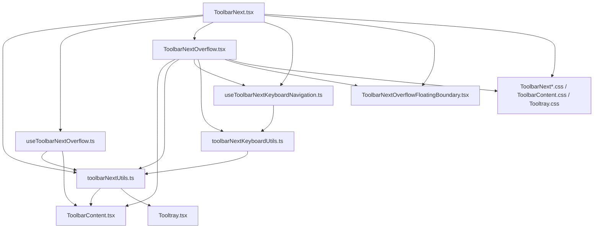
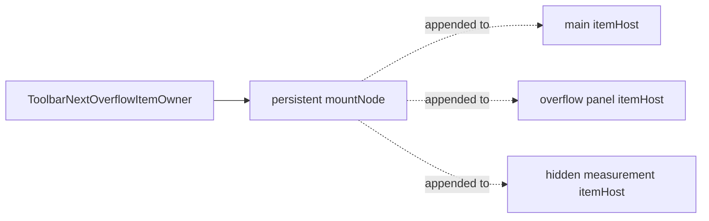
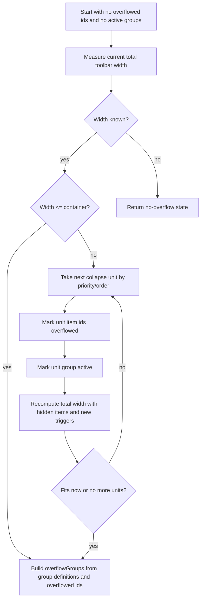

# ToolbarNext Architecture And Implementation

This document explains the current `ToolbarNext` implementation in `packages/lab/src/toolbar-next`.
It is written for reviewers who need to understand how the component works before changing or
reviewing it.

The component is not a simple flex wrapper. It is a measured, overflow-aware toolbar that:

- accepts two authoring models, then normalizes them into one internal model;
- measures tray and trigger widths outside the visible layout;
- solves which trays should remain inline and which should overflow;
- renders visible slots, overflow triggers, and hidden measurement slots;
- keeps each tray's React subtree mounted while moving it between main, overflow, and measurement hosts;
- owns keyboard navigation and focus restoration for the main toolbar and each overflow toolbar;
- coordinates descendant floating UI opened from inside overflow panels.

## Source Map

Primary implementation files:

- `ToolbarNext.tsx`: public root component, top-level rendering, host selection, focus preservation across overflow changes.
- `ToolbarContent.tsx`: explicit content-section component and CSS injection.
- `Tooltray.tsx`: tray component, overflow-related props, layout metadata.
- `toolbarNextUtils.ts`: child normalization and visible-slot construction.
- `useToolbarNextOverflow.ts`: width measurement, overflow-state computation, resize observation.
- `ToolbarNextOverflow.tsx`: overflow triggers and panels, tray ownership portals, visible content slots.
- `useToolbarNextKeyboardNavigation.ts`: event-level focus memory, Tab handling, arrow navigation integration.
- `toolbarNextKeyboardUtils.ts`: DOM queries, focus-memory resolution, keyboard policy helpers.
- `ToolbarNextOverflowFloatingBoundary.tsx`: boundary registration for floating descendants inside overflow panels.
- `ToolbarNext.css`, `ToolbarContent.css`, `Tooltray.css`, `ToolbarNextOverflow.css`: layout and measurement CSS.
- `index.ts`: package exports.

Behavioral references:

- `packages/lab/src/__tests__/__e2e__/toolbar-next/ToolbarNext.cy.tsx` covers variants, overflow measurement, remeasurement, keyboard navigation, focus restoration, child popups, and RTL.
- `packages/lab/stories/toolbar-next/toolbar-next.stories.tsx` demonstrates primary authoring models and visual variants.
- `packages/lab/stories/toolbar-next/toolbar-next-overflow-modes.stories.tsx` explains independent versus grouped overflow behavior.
- `packages/lab/stories/toolbar-next/toolbar-next-edge-cases.stories.tsx` documents dynamic content, hidden-item remeasurement, and clipping-container behavior.
- `site/docs/components/toolbar/usage.mdx` and `site/docs/components/toolbar/accessibility.mdx` describe public usage and keyboard behavior.

## High-Level Dependency Graph



## Public Components And Props

### `ToolbarNext`

`ToolbarNext` is a `forwardRef<HTMLDivElement, ToolbarNextProps>` component. It extends native
`div` props and adds:

- `appearance?: "bordered" | "transparent"`, defaulting to `"bordered"`;
- `variant?: "primary" | "secondary" | "tertiary"`, defaulting to `"primary"`.

The root element always receives:

- `role="toolbar"`;
- `aria-orientation="horizontal"`;
- `data-mode` with `"flat"`, `"explicit"`, or `"invalid"`;
- `data-salt-toolbar-next-scope-root="main"`;
- Salt classes for root, layout/fallback mode, variant, and appearance.

Consumers are expected to provide an accessible name, usually `aria-label` or `aria-labelledby`,
through native `div` props.

### `ToolbarContent`

`ToolbarContent` is a `forwardRef<HTMLDivElement, ToolbarContentProps>` component. It accepts native
`div` props and a required:

- `position: "start" | "center" | "end"`.

It renders a flex content section with `data-position={position}`. In explicit authoring mode,
`ToolbarNext` re-renders normalized `ToolbarContent` elements and forks the consumer ref with its
internal measurement ref.

### `TooltrayNext`

`TooltrayNext` is a `forwardRef<HTMLDivElement, TooltrayNextProps>` component. It accepts native
`div` props, except that `align` is redefined as:

- `align?: "start" | "end" | "center"`, defaulting to `"start"`;
- `overflowMode?: "none" | "independent" | "grouped"`, defaulting to `"independent"`;
- `overflowPriority?: number`, defaulting to `0`;
- `overflowGroup?: "shared" | string`, defaulting to `"shared"`;
- `overflowLabel?: string`.

The tray is layout-only by default. It only forwards `aria-label` and `aria-labelledby` when a
`role` is supplied. The inline documentation recommends `role="group"` plus an accessible name when
the tray is semantically meaningful.

`TooltrayNext` emits data attributes that are consumed by CSS and useful in tests:

- `data-align`;
- `data-overflow-group`;
- `data-overflow-label`;
- `data-overflow-mode`;
- `data-overflow-priority`.

## Authoring Models

`ToolbarNext` supports exactly one composition model per instance.

### Flat Model

Flat mode is used when all top-level children, after fragment flattening, are `TooltrayNext` or
`Divider` elements.

Example:

```tsx
<ToolbarNext aria-label="Flat toolbar">
  <TooltrayNext>...</TooltrayNext>
  <TooltrayNext align="end">...</TooltrayNext>
</ToolbarNext>
```

In this mode, `TooltrayNext.align` is interpreted as a toolbar-band shorthand. The normalization
logic buckets trays into implicit `ToolbarContent` models:

- `"start"` trays go into `start-implicit`;
- `"center"` trays go into `center-implicit`;
- `"end"` trays go into `end-implicit`;
- dividers go into the current bucket, which starts as `"start"` and changes whenever a tray with an
  `align` prop is encountered.

The rendered `ToolbarContent` receives `data-implicit`, and `ToolbarContent.css` cancels tray
auto-margins for implicit center/end trays so the band itself controls placement.

In flat mode, a divider before the first tray in a bucket becomes that bucket's first tray's leading
decoration. A divider left in a bucket that ends up with no tray is dropped when that empty implicit
content area is discarded.

### Explicit Model

Explicit mode is used when every top-level child is a `ToolbarContent` element.

Example:

```tsx
<ToolbarNext aria-label="Content-first toolbar">
  <ToolbarContent position="start">
    <TooltrayNext>...</TooltrayNext>
  </ToolbarContent>
  <ToolbarContent position="center">
    <TooltrayNext>...</TooltrayNext>
  </ToolbarContent>
  <ToolbarContent position="end">
    <TooltrayNext>...</TooltrayNext>
  </ToolbarContent>
</ToolbarNext>
```

In this mode, the `ToolbarContent.position` prop controls global toolbar placement.
`TooltrayNext.align` remains local to that content area.

Each explicit `ToolbarContent` is normalized into a `ToolbarNextContentModel` that includes:

- a stable content key;
- its position;
- non-child, non-position props;
- its original ref;
- a list of normalized tray items.

The content key is the authored React key when present. Otherwise it falls back to
`${position}-content-${index}`, so unkeyed explicit content is order-sensitive.

### Invalid Model

Invalid mode is used when children mix models or include unsupported elements. For example, a
top-level `ToolbarContent` beside a top-level `TooltrayNext` is invalid.

Invalid mode intentionally falls back to rendering the original children directly:

- no overflow rendering is used;
- no measurement layer is rendered;
- no bands are rendered;
- the root still has toolbar semantics and top-level keyboard handlers;
- a development-only warning is emitted once until the composition becomes valid again.

The warning text explains that children must use either direct `TooltrayNext`/`Divider` children or
`ToolbarContent` children containing `TooltrayNext`/`Divider` items.

## Normalized Data Model

The central internal model lives in `toolbarNextUtils.ts`.

```ts
export interface ToolbarNextContentModel {
  implicit: boolean;
  items: ToolbarNextOverflowItem[];
  key: string;
  position: ToolbarContentPosition;
  props: Omit<ToolbarContentProps, "children" | "position">;
  ref: Ref<HTMLDivElement> | null;
}

export interface ToolbarNextOverflowItem {
  align: NonNullable<TooltrayNextProps["align"]>;
  element: ReactElement<TooltrayNextProps>;
  id: string;
  leadingDecorations: ReactElement[];
  order: number;
  overflowGroup: string;
  overflowGroupKey: string;
  overflowLabel?: string;
  overflowMode: TooltrayNextOverflowMode;
  overflowPriority: number;
  contentKey: string;
  trailingDecorations: ReactElement[];
}
```

Important details:

- A normalized item corresponds to one `TooltrayNext`, not to each control inside a tray.
- The original `TooltrayNext` React element is stored as `item.element`.
- Item ids are built from `contentKey`, the tray's React key or fallback order key, and its order.
- Shared overflow always uses the group key `"shared"`.
- Named overflow group keys are scoped to content: `${contentKey}:${overflowGroup}`.
- Named groups with the same `overflowGroup` string in different `ToolbarContent` sections are
  separate groups.
- Dividers are not independent items. They become leading or trailing decorations attached to the
  nearest tray.

## Divider And Decoration Semantics

`normalizeContentItems` treats `Divider` children as decorations:

- one or more dividers before a tray become that tray's `leadingDecorations`;
- one or more dividers after the last tray become the last tray's `trailingDecorations`;
- dividers between two trays therefore attach to the later tray as leading decorations;
- unsupported children make the composition invalid.

Visible slots are later built by `buildContentOverflowRenderSlots`. That function decides whether
decorations should render in the main toolbar:

- leading decorations only render when the item, or its named overflow trigger replacement, has a
  surviving predecessor;
- trailing decorations only render for visible, non-overflowed items;
- hidden, non-anchor items are omitted from the main content slots.

This prevents orphan dividers at the start of content and avoids trailing separators after a tray
has moved into overflow.

## Layout Structure

After normalization, `ToolbarNext` groups content by band position in this order:

1. `start`
2. `center`
3. `end`

The root has two layout modes:

- non-centered layout uses flex and a root column gap;
- centered layout uses a three-column grid: `minmax(0, 1fr) auto minmax(0, 1fr)`.

Centered layout is activated when at least one content area has `position="center"`. In that case,
all three bands render even when a side band has no content. This is required for the grid to keep
the center column on the toolbar midpoint.

Non-centered layout omits empty start/center bands. The end band still renders when it contains
content or when shared overflow groups need a place to render their generic trigger.

The shared overflow trigger always renders in the end band. Named overflow triggers render inline
inside the content area where their group belongs.

## Render Tree

The visible render tree in valid mode is roughly:

```tsx
<div
  className="saltToolbarNext ..."
  role="toolbar"
  data-salt-toolbar-next-scope-root="main"
>
  <ToolbarNextOverflowFloatingBoundaryProvider>
    <ToolbarNextOverflowOwners items={allItems} hostNodes={itemOwnerHostNodes} />

    <div aria-hidden className="saltToolbarNext-measurements">
      {/* shared trigger measurement buttons */}
      {/* named trigger measurement slots */}
      {/* hidden item measurement slots */}
    </div>

    <div className="saltToolbarNext-band" data-band-position="start">
      <ToolbarNextOverflowContent content={...} />
    </div>

    <div className="saltToolbarNext-band" data-band-position="center">
      <ToolbarNextOverflowContent content={...} />
    </div>

    <div className="saltToolbarNext-band" data-band-position="end">
      <ToolbarNextOverflowContent content={...} />
      <ToolbarNextOverflowMenu group={sharedGroup} />
    </div>
  </ToolbarNextOverflowFloatingBoundaryProvider>
</div>
```

The important part is that `ToolbarNextOverflowContent` does not render the original tray element
directly. It renders a slot and an empty host:

```tsx
<div className="saltToolbarNextOverflow-slot" ref={getItemRef(item.id)}>
  <div className="saltToolbarNextOverflow-item">
    <div
      className="saltToolbarNextOverflow-itemHost"
      ref={getItemHostRef(item.id, "main")}
    />
  </div>
</div>
```

`ToolbarNextOverflowOwners` owns the actual `TooltrayNext` subtree and portals it into the current
host.

## Tray Ownership And Portaling

Every normalized item gets a `ToolbarNextOverflowItemOwner`.

The owner:

1. creates one persistent `mountNode` div;
2. clones the original `TooltrayNext` element with internal item and group data attributes;
3. portals the cloned tray into `mountNode`;
4. appends `mountNode` to whichever host currently owns the item.

The host preference order is:

1. overflow host, if the overflow panel for the item is open;
2. main host, if the item is currently visible inline;
3. measurement host, if the item is currently overflowed and its panel is closed;
4. no host, if no suitable host has mounted yet.



This is a critical architectural choice. Moving the same `mountNode` means the tray's React subtree
is not recreated every time the item overflows or returns. Stateful child controls, selected values,
open descendants, and focus relationships can survive reparenting.

When the owner appends a tray back to a main-toolbar host, it records and restores focusable
elements' `tabindex` values using a `WeakMap`. This protects main-toolbar keyboard behavior from
temporary `tabindex` changes that may have existed while the item was in an overflow scope.

## Overflow Groups

The overflow solver first builds group definitions from overflowable items:

- items with `overflowMode="none"` are skipped entirely;
- shared items belong to one global `"shared"` group;
- named items belong to their content-scoped group key;
- shared groups use the visible label `"More"`;
- named groups initially use the first item's `overflowLabel` when provided, otherwise
  `overflowGroup`;
- if the first item in a named group omitted `overflowLabel`, a later item in the same group can
  supply the group label;
- group order follows first appearance in the normalized item list.

`useToolbarNextOverflow` returns these definitions as `overflowTriggerGroups`. Despite that name,
the value is every possible overflow group definition, not only groups that currently have visible
triggers. `ToolbarNext` uses it to render hidden shared-trigger measurements and hidden named-trigger
measurements before those triggers are active.

The rendered trigger labels are created in `ToolbarNextOverflow.tsx`:

- shared trigger content is the Salt overflow icon;
- named trigger content is the group label;
- trigger `aria-label` includes the number of hidden trays, for example
  `"Overflow. 2 trays hidden."` or `"Actions overflow. 1 tray hidden."`.

Overflow triggers are disclosure buttons:

- `aria-expanded` reflects panel state;
- `aria-controls` points to the floating panel id;
- `aria-haspopup` is not rendered;
- the panel itself has `role="toolbar"` and `aria-orientation="horizontal"`.

## Collapse Units

The solver does not hide arbitrary controls. It hides collapse units. A collapse unit contains one
or more normalized tray item ids.

`buildCollapseUnits` applies these rules:

- `overflowMode="none"` items never become collapse units.
- `overflowMode="independent"` items always become one collapse unit per tray.
- `overflowMode="grouped"` only batches items when `overflowGroup !== "shared"`.
- Shared grouped items still collapse tray by tray.
- Named grouped items with the same content-scoped group key collapse together.
- A grouped unit uses the maximum source order and maximum priority from its member trays.

Units are sorted by:

1. higher `overflowPriority` first;
2. later source order first when priorities tie.

Therefore, higher priority means "overflow earlier" or "protect less". Lower priority trays remain
inline longer.

## Measurement Layer

`useToolbarNextOverflow` needs stable widths for:

- the toolbar content box;
- root, band, and content gaps;
- every item slot;
- every possible named trigger anchor;
- every shared trigger.

It measures three classes of DOM nodes:

- visible inline slots;
- hidden measurement slots for overflowed items whose overflow panel is not currently hosting them;
- trigger measurement nodes.

The hidden measurement container is rendered by `ToolbarNext`:

```tsx
<div aria-hidden className="saltToolbarNext-measurements">
  ...
</div>
```

CSS makes it invisible and non-interactive:

- `position: absolute`;
- `visibility: hidden`;
- `pointer-events: none`;
- `block-size: 0`;
- `overflow: hidden`.

The measurement layer exists for two reasons:

1. A hidden tray still needs to be measurable while its overflow panel is closed.
2. A trigger that is not currently visible may still need a width during the solver's "what if this
   group becomes active?" computations.

### Item Width Measurement

Item widths are measured with `measureOverflowItemWidth`.

That function starts with the slot's bounding rect, then scans visible descendants and expands the
left/right bounds to include any visible descendant that sticks out. It returns the ceiling of the
larger of:

- the slot rect width;
- the descendant visual span.

This protects against clipping or underestimated widths when decorated slots or child content
extend beyond the wrapper's nominal width.

### Trigger Width Measurement

Shared triggers are measured from hidden `Button` elements in the measurement container.

Named trigger widths are more complex. A named trigger is inline and may inherit leading divider
decorations from whichever item becomes the trigger anchor. The code therefore measures named
trigger widths per item id, not just per group key:

- if a live named trigger anchor exists, its slot width is measured;
- otherwise a hidden named-trigger measurement slot for that item is measured;
- otherwise the cached width is used.

### Width Caches

The hook keeps width caches for:

- item widths;
- named trigger widths;
- shared trigger widths.

The solver returns an empty no-overflow state when required widths are not yet available. Cached
widths allow the toolbar to continue computing while a hidden item has moved between hosts or while
a trigger is temporarily not rendered.

## Resize And Remeasurement

`useToolbarNextOverflow` uses a `ResizeObserver` to observe:

- the root container;
- visible item slots;
- hidden measurement item slots;
- live named trigger anchors;
- named trigger measurement slots;
- shared trigger measurement buttons.

Observed targets are registered through stable ref callback factories:

- `getItemRef`;
- `getNamedTriggerRef`;
- `getNamedTriggerMeasureRef`;
- `getTriggerMeasureRef`.

When a target resizes:

- container resize always schedules a measure;
- non-container resize measures the target, compares it to the cached width, updates the cache, and
  schedules a measure only if the width changed.

The hook also schedules a measure after `document.fonts.ready`, because font loading can alter text
and button widths after the first render.

Overflow work is scheduled through `requestAnimationFrame`. The hook guards against reentrant
measurement:

- `isComputingRef` is set while the scheduled computation runs;
- resize notifications during that window set `pendingMeasureRef`;
- a second animation frame clears the computing flag;
- if work was pending, another measure is scheduled.

This behavior is covered by the guarded resize Cypress test.

## Overflow Solver

The core solver is `computeToolbarNextOverflowState`.

Inputs:

- sorted collapse units;
- container content width;
- group definitions;
- item widths;
- named trigger widths;
- shared trigger widths;
- content models;
- root gap;
- band gaps;
- content gaps.

Outputs:

- `overflowedIds: Set<string>`;
- `overflowGroups: ToolbarNextOverflowGroup[]`.

The solver is deterministic and incremental:



The solver repeatedly hides collapse units until the computed width fits the available container
width or there are no more units.

### Computing Content Width

For each `ToolbarContent` area, the solver calls `buildContentOverflowRenderSlots` using:

- current `overflowedIds`;
- active named groups that belong to the content area.

Each render slot contributes:

- the item width when it remains visible;
- the named trigger width when the slot is the anchor for an active named group.

The content width is the sum of slot widths plus the content gap between slots.

### Computing Band Width

For each band position, the solver sums content widths plus band gap. The end band additionally
includes active shared trigger widths, because shared overflow triggers render only in the end band.

### Computing Total Width

Non-centered layout:

- collect non-zero band widths;
- sum them with the root gap between visible bands.

Centered layout:

- compute start, center, and end band widths;
- return `centerWidth + Math.max(startWidth, endWidth) * 2`.

This mirrors the CSS grid layout where the center column sits between symmetric flexible side
columns. The tests assert that centered content remains on the toolbar midpoint even with asymmetric
side widths and after named triggers replace side content.

## Visible Slot Construction

`ToolbarNextOverflowContent` renders each content area. It calls `buildContentOverflowRenderSlots`
with the active named groups for that content.

For each slot:

- the slot is keyed by item id, except named trigger anchors use a group-anchor key;
- `data-align` mirrors the item alignment;
- `data-priority` mirrors the item overflow priority;
- the ref is `getItemRef(item.id)` for a normal item slot;
- the ref is `getNamedTriggerRef(item.id)` when the slot is a named trigger anchor.

The slot may contain:

- cloned leading decorations;
- a main item host, if the item is not overflowed;
- a named `ToolbarNextOverflowMenu`, if this slot is the anchor for an active named group;
- cloned trailing decorations.

Overflowed items that are not named trigger anchors are not rendered in the visible content area.

## Shared Overflow

Shared overflow has one generic group key, `"shared"`, across the whole toolbar. Any overflowable
tray whose `overflowGroup` is omitted or set to `"shared"` uses this group. Trays with
`overflowMode="none"` still normalize their default group value, but they are skipped when overflow
groups and collapse units are built.

Shared overflow behavior:

- each shared tray is a separate collapse unit, even with `overflowMode="grouped"`;
- the trigger renders in the end band;
- trigger visible content is the overflow icon;
- panel label is `"More overflow"`;
- hidden shared trays render in the panel in normalized item order.

If the toolbar has no end content but a shared group is active, the end band still renders so the
shared trigger has an inline position.

## Named Overflow

Named overflow is any overflowable `TooltrayNext` whose `overflowGroup` is not `"shared"`.
Named trays with `overflowMode="none"` keep their data attributes and layout behavior, but they do
not create named overflow groups or triggers.

Named overflow behavior:

- the group key is scoped to the owning `ToolbarContent` key;
- the trigger renders inline where the first hidden item in that group would otherwise appear;
- trigger visible content is the group label;
- panel label is `${group.label} overflow`;
- the trigger slot can preserve leading decorations from the anchor item;
- grouped mode batches trays only for named groups.

Named groups are local to content sections. A `Filters` group in start content and a `Filters` group
in end content are separate groups because their internal keys include different content keys.

## Overflow Panel Implementation

`ToolbarNextOverflowMenu` renders both the trigger and the floating panel.

The trigger:

- is a Salt `Button`;
- uses transparent appearance and neutral sentiment;
- has the internal group key and overflow-trigger attributes;
- opens on click, `Enter`, or `Space`;
- closes on `Escape` when focused;
- reflects open state through `aria-expanded`;
- references the panel with `aria-controls`.

The panel:

- is rendered with Salt's `FloatingComponent`;
- uses `@floating-ui/react`;
- is non-modal;
- does not use Floating UI's return focus;
- has `role="presentation"` at the floating wrapper level;
- contains a `div role="toolbar"` with `aria-orientation="horizontal"`;
- places hidden item hosts inside flex-wrapping panel items.

Floating UI middleware:

- `offset(1)`;
- `size` to set max height to available viewport height;
- `flip`;
- `shift({ padding: 8 })`.

Panel CSS:

- uses primary container background;
- uses selected border color;
- has popout shadow;
- has max width `min(32rem, calc(100vw - var(--salt-spacing-300)))`;
- scrolls if needed;
- floats above normal content with `--salt-zIndex-flyover`.

## Focus Memory Model

Keyboard navigation stores focus memory as one of three shapes:

```ts
type ToolbarNextFocusMemory =
  | { type: "item"; itemId: string; controlIndex: number; scopeIndex: number }
  | { type: "overflow-trigger"; groupKey: string; scopeIndex: number }
  | { type: "scope"; scopeIndex: number };
```

The memory tracks both semantic identity and fallback order:

- `itemId` preserves focus across a tray moving between visible, overflow, and measurement hosts;
- `controlIndex` preserves which focusable inside a tray was focused;
- `groupKey` preserves focus on a trigger;
- `scopeIndex` provides a stable fallback when the exact item or trigger is unavailable.

`resolveToolbarNextFocusTarget` attempts, in order:

1. exact visible item control;
2. overflow trigger for the hidden item;
3. exact overflow trigger;
4. first visible item in the remembered group;
5. focusable element at the remembered scope index;
6. first focusable element in the scope.

## Main Toolbar Keyboard Navigation

The root toolbar installs capture handlers from `useToolbarNextKeyboardNavigation`:

- `onFocusCapture`;
- `onBlurCapture`;
- `onKeyDownCapture`;
- `onPointerDownCapture`.

The hook:

- remembers targets on focus and blur;
- differentiates pointer entry from keyboard entry;
- restores remembered focus when the user tabs back into the toolbar;
- intercepts Tab from most toolbar controls so Tab exits the toolbar rather than moving to every
  control inside it;
- lets native Tab behavior run for controls that need it;
- handles horizontal arrow navigation.

The toolbar does not implement a roving `tabindex` model. Instead, it lets descendants keep their
native tab stops and intercepts keyboard events to provide toolbar-level movement.

### Tab

In the main toolbar scope:

- if the focused control should preserve native Tab, the hook does not intercept;
- otherwise Tab moves to the next focusable element after the toolbar;
- Shift+Tab moves to the previous focusable element before the toolbar;
- if no next target exists, the current target is blurred.

When focus enters the toolbar from outside by keyboard, the hook attempts to restore remembered
focus rather than accepting the browser's first naturally focused control. When focus enters by
pointer, the pointer target wins.

### Left And Right Arrows

`getToolbarNextDirectionalMoveTarget` currently handles only:

- `ArrowLeft`;
- `ArrowRight`.

The target order is the visual focusable order inside the current toolbar scope. It wraps at both
ends.

RTL is handled by reading the computed `direction` of the scope root:

- in LTR, Right means +1 and Left means -1;
- in RTL, Right means -1 and Left means +1.

### Controls With Native Keyboard Needs

`toolbarNextKeyboardUtils.ts` applies special policies for common controls:

- plain text inputs, textareas, contenteditable elements, and combobox inputs preserve horizontal
  arrows and native Tab;
- dropdown controls allow Left/Right to move through the toolbar and do not preserve native Tab;
- select-like controls and date picker triggers allow toolbar arrows but preserve native Tab.

Toggle groups are handled specially:

- toggle group buttons with `tabindex="-1"` are still considered toolbar focusables;
- arrow navigation is left to the toggle group until focus reaches the group's visual boundary;
- at the boundary, toolbar navigation takes over and moves out of the group.

## Overflow Panel Keyboard Navigation

Each overflow panel creates its own `useToolbarNextKeyboardNavigation` scope:

- `scopeRef` is the panel content element;
- `includeTabIndexMinusOne` is true;
- `items` are the hidden items in that group.

Panel event listeners are attached directly to `panelContentNode` while open:

- `focusin`;
- `focusout`;
- capture `keydown`;
- capture `pointerdown`;
- bubbling `keydown` for panel-level Tab and Escape behavior.

Direct DOM listeners keep the behavior attached to the actual panel content node while the panel is
open, independent of where Floating UI portals the panel wrapper.

Panel behavior:

- opening the panel focuses the remembered item in that group or the first panel focusable;
- if focusables are not mounted immediately, mutation and resize observers wait until a focusable
  appears;
- Left/Right navigation works within the panel scope;
- Escape closes the panel and returns focus to the trigger;
- Shift+Tab closes the panel and returns focus to the trigger;
- Tab closes the panel and moves focus after the main toolbar when such a focus target exists;
- if Tab is pressed and there is no next focus target after the main toolbar, the handler leaves the
  event to the browser's native behavior;
- native Tab can still move inside the panel when a control's keyboard policy requires it and the
  next document focus target is still inside the panel.

## Focus Preservation Across Overflow Changes

Overflow changes can physically move the focused tray's DOM host. That can briefly leave
`document.activeElement` as `body`, `documentElement`, or a disconnected element.

`ToolbarNext.tsx` tracks a sorted key of `overflowedIds`. When that key changes, a layout effect:

1. checks whether focus was lost;
2. resolves the best entry focus target from current focus memory;
3. focuses it in the next animation frame, or in a microtask when RAF is unavailable.

This is the top-level safety net that preserves focus when a tray moves between main toolbar and
overflow or when an overflow panel disappears because its group becomes visible again.

## Floating Descendant Boundary

Overflow panels often contain controls that open their own portalled UI, such as dropdown lists,
combo box lists, and date picker popups. Without extra coordination, those child popups look like
outside clicks or outside focus from the overflow panel's perspective.

`ToolbarNextOverflowFloatingBoundary.tsx` solves this with two contexts:

- a boundary provider on the toolbar stores registered floating roots by boundary key;
- a floating component provider wraps each tray while it is hosted inside an overflow panel.

When a tray is inside an overflow scope, its owner computes a boundary key from the closest
`data-salt-toolbar-next-scope-root`. Main-toolbar and measurement hosts produce a `null` boundary
key. Descendant Salt floating components opened from an overflow-hosted tray register their roots
under the overflow group's key.

`isTargetInsideOverflowBoundary` returns true when the event target is:

- inside the overflow panel content; or
- inside a registered descendant floating root for that overflow group.

This allows:

- selecting an option from a dropdown inside overflow without closing the overflow panel;
- preserving focus while interacting with child popups;
- closing both parent and child popups on true outside press;
- raising descendant popup z-index above the overflow panel with
  `.saltToolbarNextOverflow-floatingDescendant`.

## Accessibility Semantics

Main toolbar semantics:

- root `role="toolbar"`;
- root `aria-orientation="horizontal"`;
- consumers provide the toolbar accessible name.

Tray semantics:

- trays are layout-only unless consumers pass a `role`;
- when a tray is a meaningful subgroup, use `role="group"` and an accessible name.

Overflow trigger semantics:

- trigger is a `button`;
- trigger has `aria-expanded`;
- trigger has `aria-controls`;
- trigger has an `aria-label` describing the group and hidden-tray count;
- trigger does not use `aria-haspopup`.

Overflow panel semantics:

- panel content has `role="toolbar"`;
- panel content has `aria-orientation="horizontal"`;
- panel content is labelled as `${group.label} overflow`.

Keyboard semantics:

- documented keyboard support covers Tab, Shift+Tab, Left Arrow, and Right Arrow;
- implementation matches that documented key set;
- Up/Down/Home/End are not implemented by the current keyboard utility.

## CSS Responsibilities

`ToolbarNext.css`:

- establishes root sizing and positioning;
- switches between flex and centered grid layouts;
- styles bands;
- applies variant tokens;
- applies bordered or transparent appearance;
- defines the hidden measurements layer.

`ToolbarContent.css`:

- renders content areas as flex rows;
- applies content gap;
- justifies content by position;
- cancels local tray auto-margins in implicit flat mode.

`Tooltray.css`:

- renders trays as non-shrinking flex rows;
- applies tray gap;
- keeps direct children from shrinking;
- uses margins for local `align="center"` and `align="end"`.

`ToolbarNextOverflow.css`:

- lays out visible slots and overflow panel items;
- applies alignment margins on slots;
- uses `display: contents` for item and content hosts;
- styles overflow triggers;
- styles floating panels and panel content;
- resets tray margins inside panels;
- raises descendant floating popups above the parent overflow panel.

## Invariants To Preserve

The implementation relies on these invariants:

- One normalized item equals one `TooltrayNext`.
- Normalized item ids must remain stable for equivalent keyed children.
- Every valid `ToolbarContent` must eventually get a content ref for gap measurement.
- Every item must eventually have either a visible slot width, a hidden measurement width, or a
  cached width.
- Shared overflow trigger widths are available even before shared overflow is active.
- Named trigger widths are measured per anchor item because decorations can alter trigger slot
  width.
- Shared overflow renders only in the end band.
- Named overflow renders inline inside its owning content area.
- An item's React subtree is owned by `ToolbarNextOverflowItemOwner`, not by visible slots.
- Host priority must prefer overflow over main over measurement.
- The main toolbar scope root uses the literal value `"main"`.
- Overflow panel scope roots use the overflow group key.
- Focus memory must be updated before moving focus programmatically.
- Pointer entry must not be treated as keyboard re-entry.
- Descendant floating roots opened from an overflow item must be registered under the item's current
  overflow boundary.

## Review-Critical Edge Cases

### Hidden Items That Change Width

When a hidden tray changes intrinsic width while the overflow panel is closed, the tray is still
mounted in a measurement host. That measurement host is observed, so the cached item width updates
and the solver can decide whether the item may return inline.

This is covered by tests that change hidden labels from short to long and long to short.

### Visible Items That Change Width

Visible slot wrappers are observed. If a child button or control changes intrinsic width without a
parent resize, the slot width changes, the cache updates, and the solver reruns.

This is covered for both shared and named overflow.

### Resize During Computation

The hook guards measurement with `isComputingRef` and `pendingMeasureRef`. If a `ResizeObserver`
notification arrives while compute work is still considered active, it queues another measure after
the guard clears.

This protects against dropping resize work in the same frame as an overflow state update.

### Centered Layout

Centered layout uses a symmetric width formula in the solver and a symmetric CSS grid in layout.
Any change to band rendering, root gaps, or grid gaps must keep those formulas in sync.

### Dividers Near Overflow Boundaries

Dividers are attached to items, and visible slot construction suppresses orphan separators. Named
trigger anchors may preserve leading dividers, so trigger measurement must include decorations.

### Toggle Groups

Toggle groups depend on a handoff rule. Toolbar arrows should not steal movement inside the group
until focus reaches the group boundary. Disabled leading toggles are covered in both main and
overflow scopes.

### Native Input Controls

Plain text inputs and combobox inputs preserve horizontal arrows. Select-like controls and date
picker triggers preserve native Tab. Dropdowns allow toolbar arrows and toolbar Tab behavior.

Changing the keyboard policy affects whether composite child controls remain usable.

### Child Popups Inside Overflow

Dropdown and combo box popups inside overflow are portalled outside the panel. They must be treated
as inside the overflow boundary for dismissal and focusout decisions. This depends on the floating
boundary provider and descendant floating component wrapper.

### Parent Rerenders While Panel Is Open

The panel keeps focus across parent rerenders by relying on stable owner nodes, focus memory, and
panel-level focus handling. Avoid adding keys that remount the owner or panel content unnecessarily.

## Testing Coverage Summary

Current Cypress coverage exercises:

- default variant and appearance classes;
- secondary and tertiary variants;
- transparent appearance;
- default shared overflow when `overflowMode` is omitted;
- independent and grouped named overflow behavior;
- priority ordering;
- divider-heavy overflow layouts;
- named trigger anchor measurement with dividers;
- custom spacing in overflow decisions;
- intrinsic visible width changes;
- intrinsic hidden width changes;
- guarded resize scheduling;
- centered layout with asymmetric side widths;
- centered layout with only an end side band;
- centered layout after named overflow activation;
- focus restoration when tabbing back into the toolbar;
- pointer entry into dropdowns and switches;
- Tab and Shift+Tab exiting the toolbar;
- horizontal wrap;
- native keyboard behavior for text inputs, combo boxes, dropdowns, date picker triggers, and
  toggle groups;
- overflow disclosure semantics;
- overflow panel focus entry, Escape, Tab, and Shift+Tab;
- focus restoration between named triggers and hidden items;
- child dropdown and combo box popups inside overflow panels;
- z-index for reopened child popups;
- item return from overflow to main toolbar;
- viewport-constrained floating panels;
- parent rerenders while an overflow panel is open;
- RTL visual ordering.

## Implementation Risks And Reviewer Notes

### Measurement And CSS Must Stay In Sync

The solver manually models the CSS layout. If root layout, band gaps, content gaps, grid columns, or
overflow trigger placement change, update both CSS and `computeToolbarNextOverflowState`.

### Stable Keys Matter

Item ids include the React key when present and the item order. Dynamic toolbars should key trays
that can be inserted or removed. Without stable keys, a reorder can change item ids, which changes
focus memory and cached widths.

### Named Group Scope Is Content-Local

Named overflow groups are intentionally scoped by content key. If product expectations require one
named trigger across multiple content areas, that is not how the current implementation works.

### The Shared Group Is Global

Shared overflow uses one group key for all content. Hidden shared items from start, center, and end
content all flow into the generic end-band overflow trigger.

### `overflowMode="grouped"` Does Not Batch Shared Items

Grouped batching applies only when `overflowGroup !== "shared"`. This is deliberate in the current
stories and tests. Shared items still collapse one tray at a time by priority and order.

### `overflowTriggerGroups` Means Possible Groups

The `useToolbarNextOverflow` return value named `overflowTriggerGroups` contains all group
definitions derived from overflowable items. It is used to pre-measure trigger widths, so it is not
equivalent to the active `overflowGroups` list.

### Trigger Labels Count Trays, Not Controls

The accessible trigger label reports hidden tray count. A tray can contain multiple controls, so the
count is not a hidden-control count.

### Invalid Composition Still Has Toolbar Semantics

Invalid composition falls back visually but the root remains a toolbar and still installs keyboard
handlers. This is useful for graceful rendering, but invalid trees should not be treated as
fully-supported overflow layouts.

### Keyboard Support Is Horizontal

The current implementation supports Left and Right arrows for toolbar navigation. Up, Down, Home,
and End are not handled by `getToolbarNextDirectionalMoveTarget`.

## Change Checklist For Future Work

When reviewing changes to `ToolbarNext`, verify:

- Does the normalized model still represent one item per tray?
- Are explicit and flat authoring modes still mutually exclusive?
- Are dividers still attached to adjacent items without orphan rendering?
- Does every visible or hidden item still have a measurable slot?
- Are shared and named trigger widths available before they become visible?
- Does the overflow solver still match CSS layout?
- Are collapse units sorted by higher priority, then later source order?
- Do grouped named trays still collapse as one unit?
- Do shared grouped trays still collapse independently?
- Does focus memory survive item movement between main, overflow, and measurement hosts?
- Does pointer entry still avoid unexpected focus restoration?
- Do child floating components inside overflow remain inside the overflow dismissal boundary?
- Are tests updated for any changed keyboard, overflow, or accessibility contract?
