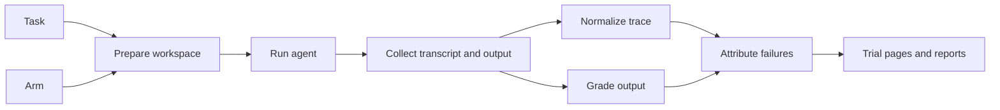

# Architecture

The harness that turns a task and an arm into a graded trial you can inspect. This page describes the target shape; the [roadmap](../roadmap.md) builds it a slice at a time, starting with one task end to end.

## Flow

## Components

| Component          | Responsibility                                                                                                                                                                                               |
| ------------------ | ------------------------------------------------------------------------------------------------------------------------------------------------------------------------------------------------------------ |
| Task bank          | Tasks as defined in [tasks.md](./tasks.md). Dev tasks live here; held-out tasks live in the private store                                                                                                    |
| Starting points    | Frozen apps with lockfiles, shared across tasks                                                                                                                                                              |
| Arm definitions    | Agent program and version, model and settings, Salt version and the context products, including how each attaches: MCP server configuration, skill or instruction files, bundled docs, allowed network hosts |
| Workspace preparer | Copies the starting point outside the repository, installs the pinned Salt packages, creates a single-commit git history and a clean agent configuration directory, then attaches the arm's context products |
| Agent adapters     | One per agent program. Each launches its program headlessly with the request, enforces time and turn limits and captures the raw transcript                                                                  |
| Trace normalizer   | Turns each agent program's transcript into the common trace                                                                                                                                                  |
| Graders            | Gates, browser checks with Playwright and axe-core, source checks against the pinned Salt types, the judge runner and the exposure detector                                                                  |
| Results store      | One directory per trial in the private store: pins, request, transcript, trace, diff, build logs, screenshots, verdicts and attributions                                                                     |
| Viewer and reports | Static HTML: a page per trial with each verdict linked to its evidence, a table per run, comparison reports and the anchor scorecard                                                                         |

## Isolation

The agent under test sees what a Salt consumer's agent would see, and nothing more.

- **Outside the repository.** Workspaces live in a temporary directory, so the agent can't walk up into Salt source, repository rules or the task bank.
- **Consumer install.** Salt comes from the registry at a pinned version, or from tarballs packed from a Salt commit when testing unreleased guidance or components. It's never linked to `packages/*`.
- **Fresh state.** Every trial gets a new copy of the starting point with a single-commit git history. Leftover files and history can hand the agent the answer.
- **Clean agent configuration.** Every trial gets its own configuration directory. User-level rules, skills, MCP servers and memories on the host machine must not reach the agent.
- **Graders stay outside.** Checks, rubric items and reference solutions never enter the workspace. Grading runs on a copy of the output after the agent exits.
- **Network by arm.** A baseline blocks web access. Arms that test the Salt website or a hosted MCP server allow only those hosts.

## Traces

Attribution depends on knowing what reached the agent, so the trace keeps:

- every message, tool call and tool result, untruncated
- the files the agent read and wrote
- the commands it ran and their output
- tokens, time and errors

When an agent program's transcript omits or truncates tool results, capture them at the source, for example by running MCP servers behind a logging proxy. Access to full tool results is a requirement when choosing an agent program.

## Reproducibility

- Every trial records its pins, and a run refuses to mix pins within an arm.
- Agent programs are installed at a pinned version for each run, and models are pinned by exact identifier, never by alias.
- Stored outputs can be regraded without rerunning the agent. When a check is fixed, rescore old trials instead of paying for new ones.

## What lives where

| What                                                | Where                                                | Why                                                                           |
| --------------------------------------------------- | ---------------------------------------------------- | ----------------------------------------------------------------------------- |
| Harness code, dev tasks, starting points, docs      | `salt-eval/` in this repository                      | Reviewed alongside Salt changes and visible to agents improving Salt guidance |
| Held-out tasks and tasks derived from internal work | Private store                                        | The repository is public; keeps them out of tuning and out of training data   |
| Transcripts, traces, outputs, screenshots, verdicts | Private store                                        | Large, may contain internal details and never belong in git                   |
| Comparison reports                                  | Private store, with summaries published deliberately | Numbers travel without their caveats                                          |

The harness finds the private store through an environment variable. Where the store lives and who can read it is a Phase 0 decision.

## First slice

Roadmap Phase 2 builds only this: one agent program, one starting point, one task, the baseline arm, the gates plus that task's checks, a trial directory with trace and output and a static trial page. Everything else waits until a result shows it's needed.

## Open decisions

These are tracked in the [roadmap](../roadmap.md#open-decisions):

- **Harness language.** Default: TypeScript on Node, reusing the repository's Playwright, axe-core, Vitest and Biome.
- **The first agent program.** It must run headlessly and expose full tool results.
- **How salt-eval joins the Yarn project.** The root workspace globs, `packages/**` and `tooling/**`, don't cover `salt-eval/`. It can be listed as a workspace or be a standalone project with its own lockfile. Either way, starting points must never resolve `@salt-ds/*` to local source.
- **The private store's location and access.**
